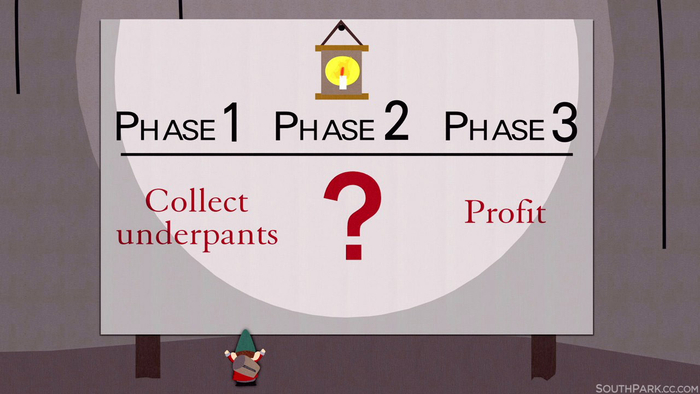

# Maestro-DB
A distributed append only commit log used for quick writes and reads to any scale 

# Part 1 - Scaffolding
[Part-1 Notes](assets/Part-1%20Notes.md)
- Going to start off with building a simple Json over HTTP commit log
- Purge json use in favor for protobufs
- Wirte a log package which will be used for storing and looking up data

# Part 2 - Networking
[Part-2 Notes](assets/Part-2%20Notes.md)
- Setup and server and client to to define actions via gRPC
- Setup SSL/TLS to encrypt our data exchange between the client and the server
- Add in observibility...Metrics + Logs

# Part 3 - Distribute
- Make our services dicoverable
- Cordinate our microservices using consensus
- Load balancing

# Part 4 - Deployment
- Deploy codebase with Kubernetes locally
- Add in terraform to deploy on GKE

# Part 6 - Performance/Observability
- Stess testing for benchmarking performance
- Prom metrics
- Tracing
- Add indexing options starting with [B-Tree](https://github.com/amit-davidson/btree/blob/main/btree.go) and evaluate other indexing options

# Part 7 - UI
- Build out GraphQL layer that gets wrapped into the protobuf...Potentially swagger docs
- Front end that can be the overload to the entire project.

# Part 8 - CI/CD
- Build out github actions and ensure test coverage is at 100%

# Part 1000 - Profits

# Technologies Used
* [Cosmik Air](https://github.com/cosmtrek/air) - ☁️ Live reload for Go apps

* [Evans Client](https://github.com/ktr0731/evans) - RPC client that allows you to construct and send requests to gRPC server in an interactive shell

* [Godoc](https://pkg.go.dev/golang.org/x/tools/cmd/godoc) - Extracts and generates documentation for Go programs.It runs as a web server and presents the documentation as a web page.

* [GHZ](https://ghz.sh/) - Load testing tool to enable better benchmarking

* [Open Cencus](https://pkg.go.dev/go.opencensus.io/trace) - Tracing lib

* [Go-Proto-GQL](https://github.com/danielvladco/go-proto-gql) - Converts protobufs into tangible GraphQL end points

* [gRPC-Cheat-Sheet](https://github.com/grpc-ecosystem/awesome-grpc) - Link to all the awesome gRPC projects out there